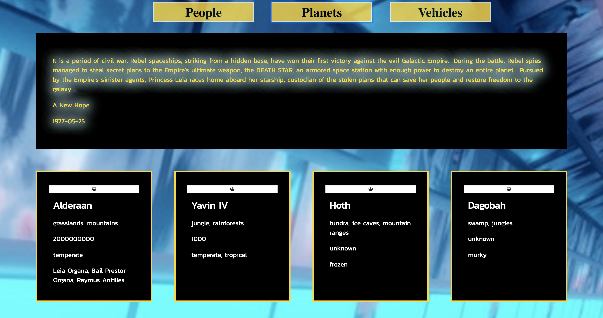
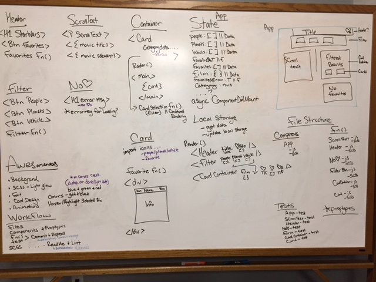

# SWapi-Box: Mod 3

## Description

The task was to build a site that would display fact cards with Star Wars API data based on the chosen category (people, planets, vehicles). The user selects the category, views the cards, and can save their favorites by clicking the favorites button on the card. The next iternation of this site will display all favorited cards.
This project was bootstrapped with [Create React App](https://github.com/facebook/create-react-app). 

## Learning Goals
* Learn how to wireframe and know why it is important.
* Write squeaky clean, well refactored code using ES6 & ES7 syntax.
* Make informed design decisions to create a user-friendly application.
* Keep state based components to a minimum and leverage more functional components.
* Use a modular architecture for your application file structure.
* Think deeply about React Lifecycle Methods.
* Use propTypes for every component receiving props.

## Successes
Completing the solo project was exciting as obtaining the correct data using fetch calls was new, but simple to configure. I learned how to create functional components and use async testing.

## Challenges
Due to factors outisde of the program, my time for completion was limited and thus, the site is not fully functional nor fully tested. It is a less than satisfactory demonstration.

## Technologies Used

* HTML 
* ES6 classes
* SCSS
* JavaScript
* React
* Manipulating APIs (fecth calls)
* Testing with Jest & Enzyme (async)
* Webpack
* NPM
* ESLint

## To View This Site:

Fork this repo. 

Clone the repo using 'git clone git@github.com:{your github name here}/Memoize.git'

### `npm start`

Runs the app in the development mode. 
Open [http://localhost:3000](http://localhost:3000) to view it in the browser.

The page will reload if you make edits. 
You will also see any lint errors in the console.

### `npm test`

Launches the test runner in the interactive watch mode. 
See the section about [running tests](https://facebook.github.io/create-react-app/docs/running-tests) for more information.

# Screenshots

### Home Page

### Cards

### WireFrame

### Mobile View

Coming Soon....

### Issues

* Not all functionality is tested
* Favorite button is not functional
* Favorite cards are not saved to local storage
* Control button icons do not display

## Collaborators
* Katie Lewis (https://github.com/kalex19)

### License
Turing School of Software (for providing the project specifications).

